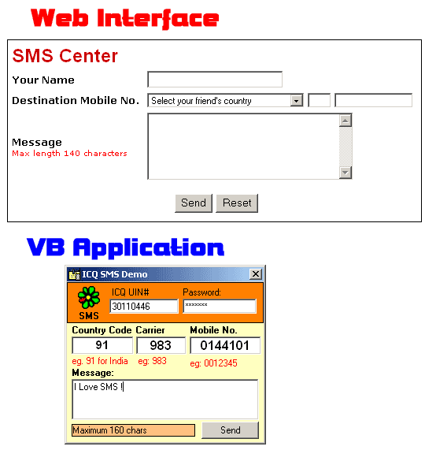



## ICQ SMS Activex Component \(Updated 19th October 2002\)

### Description

For all those developers who want to integrate the Mobile SMS feature in their applications can now do it using this ActiveX dll component in Visual Basic which can send your SMS messages through the ICQ Network from ASP / Visual Basic applications and that too for FREE :)

I would be glad if you all please do give your valuable feedback and yes don't forget to vote for my code. Till then Happy SMS'ing.
 
### More Info
 
ICQSMS.SendSMS IcqUIN, Password, Prefix, Carrier, MobileNumber, Message As Variant

To run this application you'll need Microsoft Internet Transfer Control and Visual Basic Runtime dll installed onto your system.

             |
---                |---
**Submitted On**   |2002-10-19 13:11:50
**By**             |[Vijay Bhatter](https://github.com/Planet-Source-Code/PSCIndex/blob/master/ByAuthor/vijay-bhatter.md)
**Level**          |Intermediate
**User Rating**    |5.0 (35 globes from 7 users)
**Compatibility**  |VB 5\.0, VB 6\.0, VB Script, ASP \(Active Server Pages\) 
**Category**       |[OLE/ COM/ DCOM/ Active\-X](https://github.com/Planet-Source-Code/PSCIndex/blob/master/ByCategory/ole-com-dcom-active-x__1-29.md)
**World**          |[Visual Basic](https://github.com/Planet-Source-Code/PSCIndex/blob/master/ByWorld/visual-basic.md)
**Archive File**   |[ICQ\_SMS\_Ac14838610192002\.zip](https://github.com/Planet-Source-Code/vijay-bhatter-icq-sms-activex-component-updated-19th-october-2002__1-39953/archive/master.zip)

